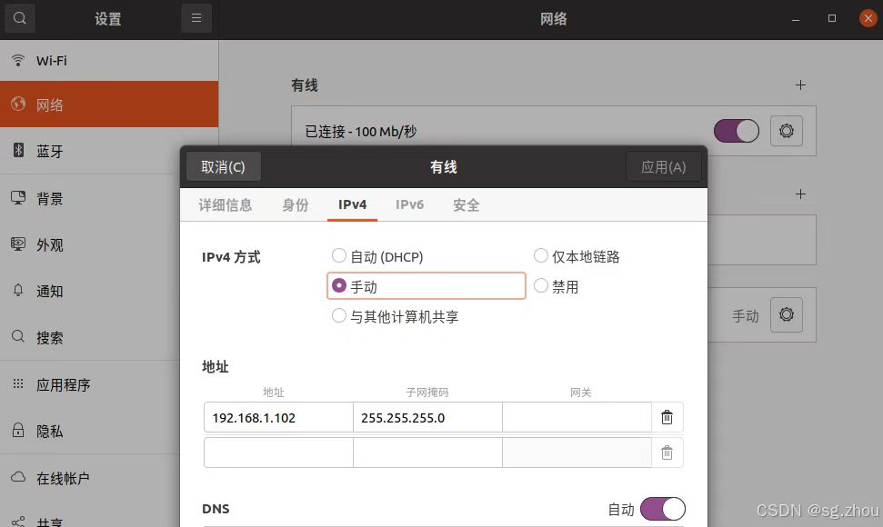
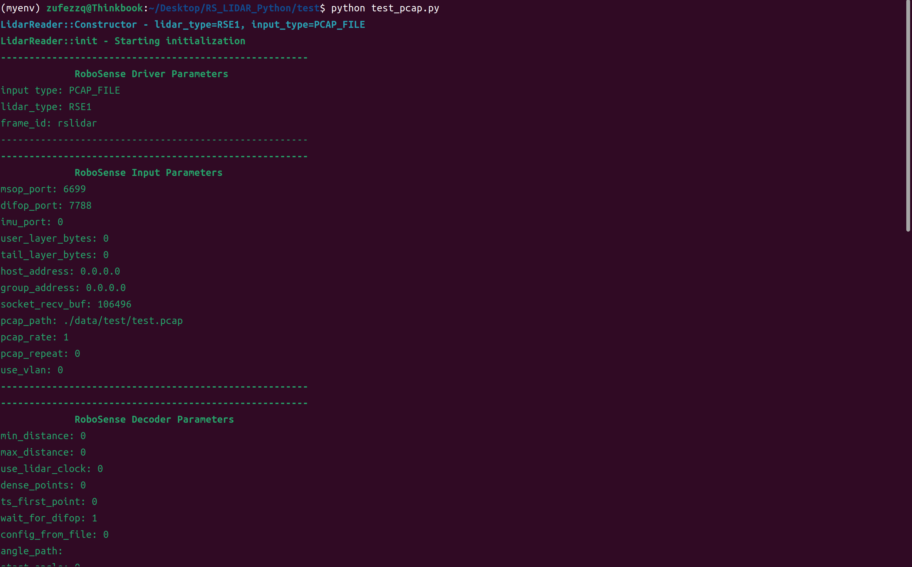
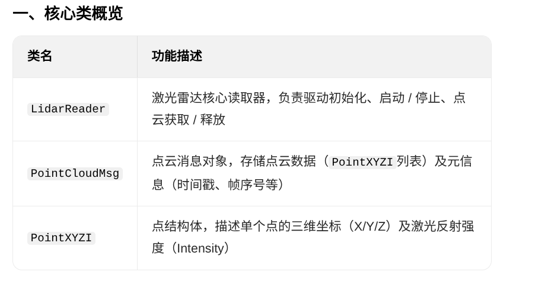
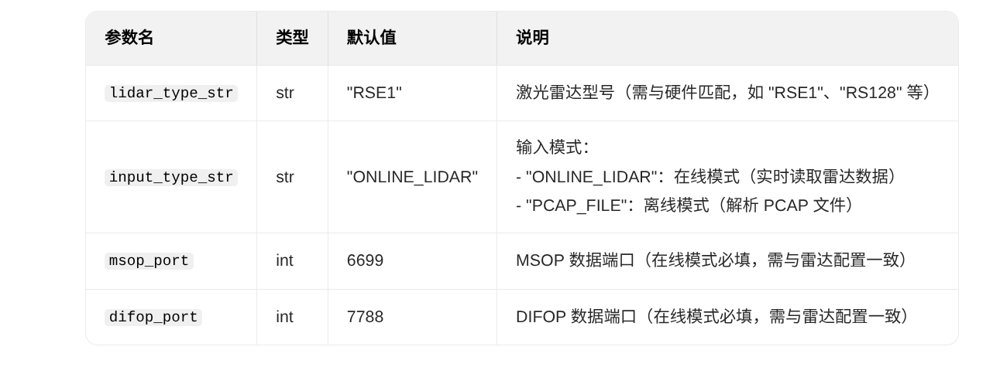
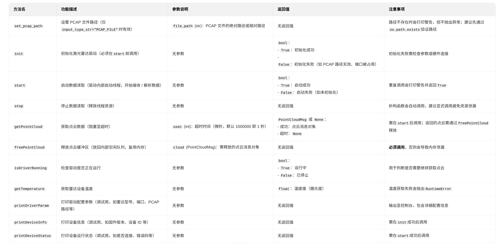
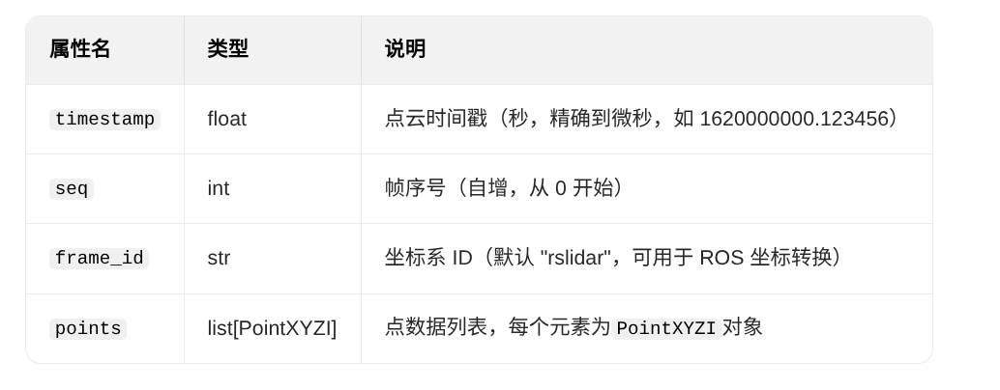
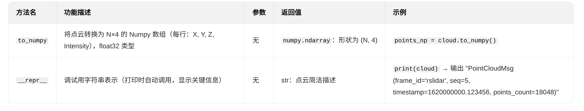
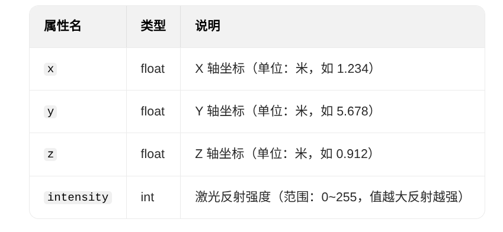
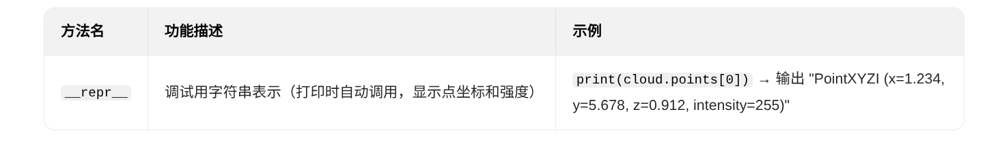
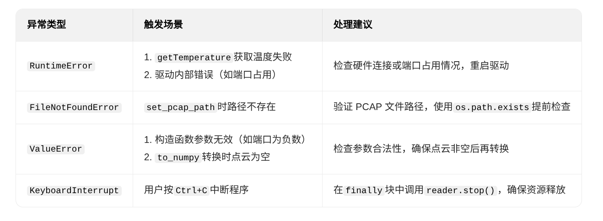

## 依赖声明


本项目基于 **RoboSense LiDAR SDK——rs_driver**（版权所有 © 2020 RoboSense）开发，遵循其3-clause BSD License协议。
使用前请确保已获取RoboSense SDK的合法授权（商业使用需联系RoboSense获取授权）。 
**rs_driver_update**基于[rs_driver](./../rs_driver_update/README_CN.md)进行了小部分修改


## 编译安装

### 源码文件夹
1. **rs_driver_update**
2. **rs_lidar_pyhton**

### 先决条件

1. 设置ip

  -查看是否可以ping通
  bash :  ping 192.168.1.102 
2. C++编译器支持：g++ >= 7.0(C++17)
3. CMake >= 3.10
4. Python编译器支持：3.6<=Python<=3.14
5. **rs_driver_update**依赖：
```bash 
sudo apt-get install libpcap-dev
libeigen3-dev libboost-dev libpcl-dev
```
6. **rs_lidar_pyhton**依赖：
  - 在*RS_LIDAR_Python*目录下执行
```bash
pip install -r ./rs_lidar_pyhton/requirements.txt 
```
7. 确认rs_lidar_python中rs_driver安装路径(**默认已经设置好了,一般不需要修改**)
[setup.py](./../rs_lidar_pyhton/src/setup.py)
```python
def get_extensions():
    # 头文件路径（适配RoboSense SDK安装路径）
    rs_driver_include = os.getenv("RS_DRIVER_INCLUDE", 
    "/usr/local/rs_driver/include/")  # RoboSense rs_driver头文件路径
```

### rs_driver_update编译安装

- 在*RS_LIDAR_Python*目录下执行
```bash
cd rs_driver_update
mkdir build && cd build
cmake .. && make -j4
```
 - 若编译失败可以尝试修改[CMakeLists.txt](./../rs_driver_update/CMakeLists.txt)中
```cmake
option(COMPILE_TOOL_VIEWER "Build point cloud visualization tool" ON)
option(COMPILE_TOOL_PCDSAVER "Build point cloud pcd saver tool" ON)
option(COMPILE_TESTS "Build rs_driver unit tests" ON)
```
**ON->OFF**不影响python包的使用
4. sudo make install

#### rs_lidar_pyhton编译安装

- *RS_LIDAR_Python*目录下执行
```bash
cd rs_lidar_pyhton/src
python setup.py bdist_wheel
pip install dist/*.whl
```

### pip show rs_lidar

- **pip show**
```
pip show rs_lidar
```

- **输出**
```bash

Name: rs_lidar
Version: 0.1.0
Summary: 基于RoboSense LiDAR SDK的Python/封装库，支持在线/PCAP点云读取与Numpy转换
Home-page: https://github.com/GoldenPigeon123
Author: Zhejiang University of Finance and Economics - Point Cloud Team: 
Zhang Zhongqain , Li Huaiyuan , Cao Yiyun 
浙江财经大学信息技术与人工智能学院点云组:张忠谦,李怀苑,曹宜云                                              
Author-email: 2789632062@qq.com
License: BSD-3-Clause
Location: /home/zufezzq/.local/lib/python3.10/site-packages
Requires: numpy, pybind11
Required-by: 
```

### 快速测试

在*RS_LIDAR_Python*目录下执行
```bash
cd test
python test_pcap.py
```


**若无效请尝试**
```bash
# 关闭防火墙
sudo ufw disable || true
```

## 使用说明
### 1. 导入rs_lidar 库
```python
import rs_lidar
```
### 2. 创建Lidar对象
请选择好你的Lidar类型，以及工作模式，确认msop_port与difop_port端口，然后初始化并启动Lidar
#### ONLINE_LIDAR：在线雷达模式
```python
reader = rs_lidar.LidarReader("RSE1", "ONLINE_LIDAR", 6699, 7788)
reader.init()
reader.start()
```
#### PCAP_FILE：PCAP文件模式
```python
reader = rs_lidar.LidarReader("RSE1", "PCAP_FILE", 6699, 7788)
reader.set_pcap_path("your.pcap")
```

### 3.初始化并启动Lidar
```python
reader.init()
reader.start()
```

### 4. 获取点云数据并转换为Numpy数组
```python
cloud=reader.getPointCloud()
points_np = cloud.to_numpy()
```
### 5. 释放资源
```python
reader.freePointCloud(cloud)
```

### 6. 关闭Lidar
```python
reader.close()
```

## 详细API

### 核心类与结构概览


### 详细API说明
#### 核心类LidarReader

- **构造方法**
```Python
rs_lidar.LidarReader(lidar_type_str="RSE1", input_type_str="ONLINE_LIDAR", 
  msop_port=6699, difop_port=7788)
```
- **参数说明**


- **方法说明**


#### 点云消息类：PointCloudMsg

- **属性说明**


- **方法说明**


#### 点结构体类：PointXYZI

- **属性说明**


- **方法说明**



### 异常捕获


## 联系我们

- 学校：浙江财经大学
- 地址：浙江省杭州市下沙高教园区学源街18号
- 团队：浙江财经大学信息技术与人工智能学院点云组
- 邮箱：2789632062@qq.com
- GitHub: [https://github.com/GoldenPigeon123](https://gdithub.com/GoldenPigeon123)


## 附录

rs_driver_update基于[rs_driver](./../rs_driver_update/README_CN.md)进行了小部分修改，修改点如下：

### rs_driver修改点

1. [rs_driver/driver/driver_param.hpp](./../rs_driver_update/src/rs_driver/driver/driver_param.hpp)

```C++
inline InputType strToInputType(const std::string& type)
{
  static const std::unordered_map<std::string, InputType> strInputTypeMap = {
      {"ONLINE_LIDAR", InputType::ONLINE_LIDAR},
      {"PCAP_FILE", InputType::PCAP_FILE},
      {"RAW_PACKET", InputType::RAW_PACKET}
  };

  auto it = strInputTypeMap.find(type);
  if (it != strInputTypeMap.end()) {
      return it->second;
  } else {
    RS_ERROR << "Wrong input type: " << type << RS_REND;
    RS_ERROR << "Please give correct type: ONLINE_LIDAR, PCAP_FILE, RAW_PACKET." << RS_REND;
    exit(-1);
  }
}
```

```C++
struct DeviceInfo{
    void print(){
    RS_INFO << "------------------------------------------------------" << RS_REND;
    RS_INFO << "             RoboSense Device Info " << RS_REND;
    RS_INFOL << "state: " << state << RS_REND;
    RS_INFOL << "sn: " << sn << RS_REND;
    RS_INFOL << "mac: " << mac << RS_REND;

    RS_INFOL << "top_ver: " << top_ver << RS_REND;
    RS_INFOL << "bottom_ver: " << bottom_ver << RS_REND;
    RS_INFOL << "------------------------------------------------------" << RS_REND;
  }
}
```

```C++

struct DeviceStatus{
    void print(){
    RS_INFO << "------------------------------------------------------" << RS_REND;
    RS_INFO << "             RoboSense Device Status " << RS_REND;
    RS_INFOL << "state: " << state << RS_REND;
    RS_INFOL << "voltage: " << voltage << RS_REND;
    RS_INFO << "------------------------------------------------------" << RS_REND;
  };
}
```

