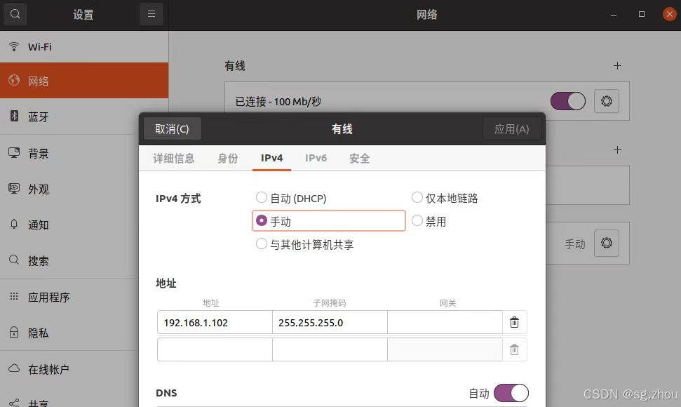

## 编译安装

### 源码文件夹
1. **rs_driver_update**
2. **rs_lidar_src**

### 先决条件

1. 设置ip

  -查看是否可以ping通
  bash :  ping 192.168.1.102 
2. C++编译器支持：g++ >= 7.0(C++17)
3. CMake >= 3.10
4. Python编译器支持：3.6<=Python<=3.14
5. **rs_driver_update**依赖：
```bash 
sudo apt-get install libpcap-dev
libeigen3-dev libboost-dev libpcl-dev
```
6. **rs_lidar_src**依赖：
  - 在*RS_LIDAR_Python*目录下执行
```bash
pip install -r ./python/requirements.txt 
```

### rs_driver_update编译安装

- 在*rs_driver_update*目录下执行

```bash
mkdir build && cd build
cmake .. && make -j4
sudo make install
```
- 若编译失败可以尝试修改[CMakeLists.txt](./../rs_driver_update/CMakeLists.txt)中

```cmake
option(COMPILE_TOOL_VIEWER "Build point cloud visualization tool" ON)
option(COMPILE_TOOL_PCDSAVER "Build point cloud pcd saver tool" ON)
option(COMPILE_TESTS "Build rs_driver unit tests" ON)
```
**ON->OFF**不影响python包的使用

#### rs_lidar_src编译安装

[编译配置自定义](./../rs_lidar_src/src/CMakeLists.txt)

```cmake
option(BUILD_PYTHON_PACKAGES "Build Python packages" ON)
option(COMPILE_DEMO "Compile demo programs" ON)
option(USE_PCL_POINT_TYPE "Use PCL point cloud type instead of custom type" ON)
option(EXECUTIONLIB "Include execution in .cpp" OFF)
option(PRINT_PARAMETER "cout parameters of lidar to console" OFF)
option(PRINT_DEBUG "cout debug to console" OFF)
option(PRINT_MSG "cout brief message of every frames to console when 'getPointCloud' call" OFF)
option(RS_TIME_RECORD "cout time record to console" OFF)
```

- *cpp*目录下执行
```bash
chmod +x cmake_make.sh
chmod +x clean_build.sh
chmod +x test_pcap.sh

./cmake_make.sh
./test_pcap.sh
```

- *python*目录下执行

```bash
chmod +x bdist_wheel.sh
chmod +x clean_build.sh
chmod +x pip_install_wheel.sh
chmod +x run_test_pcap.sh

./bdist_wheel.sh
./pip_install_wheel.sh
./run_test_pcap.sh
```

**若无效请尝试**
```bash
# 关闭防火墙
sudo ufw disable || true
```