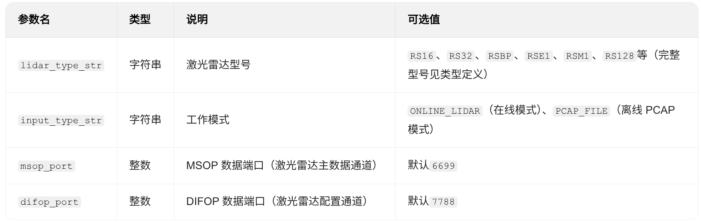
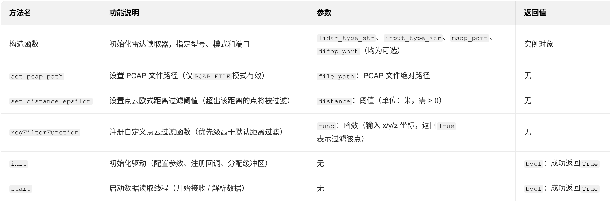
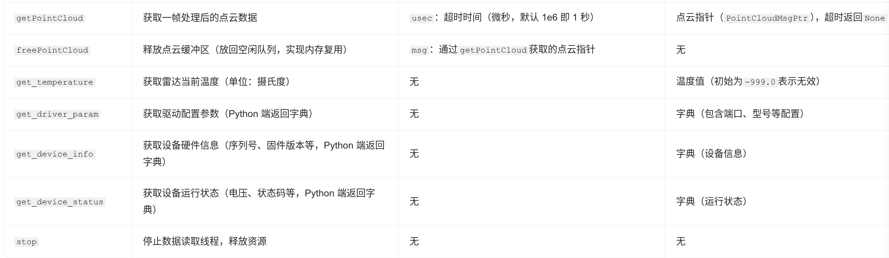
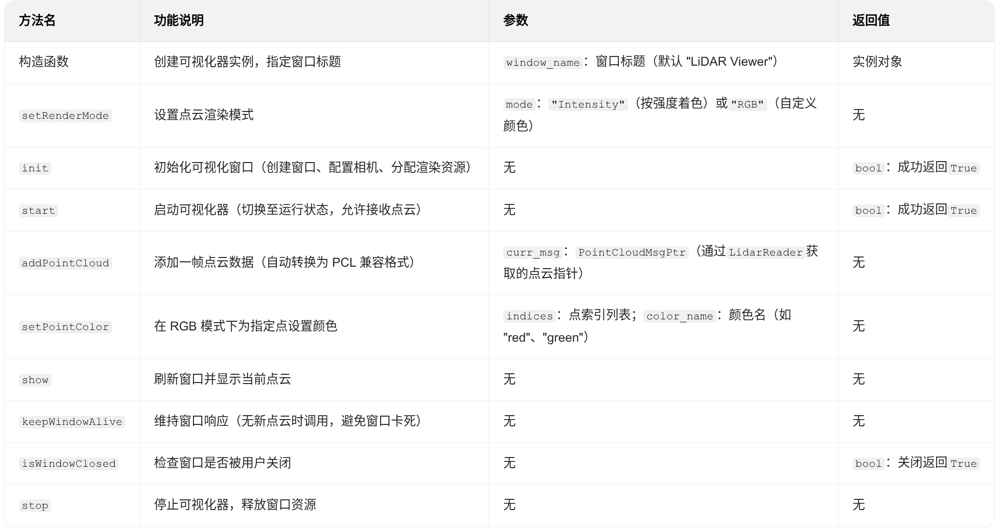

## RoboSense 激光雷达数据读取与可视化工具使用说明

### 概述
本文档详细介绍 LidarReader（激光雷达数据读取器）和 LidarViewer（激光雷达点云可视化器）的使用方法，包括初始化配置、数据获取、点云显示等核心流程，适用于在线雷达数据采集和离线 PCAP 文件解析场景。

### 1. LidarReader API

LidarReader 封装了激光雷达驱动核心逻辑，支持在线实时读取雷达数据和离线解析 PCAP 文件，提供点云过滤、设备信息查询等功能。

### 2. LidarViewer API
LidarViewer 封装了点云可视化核心逻辑，支持点云显示,自定义颜色渲染功能。

