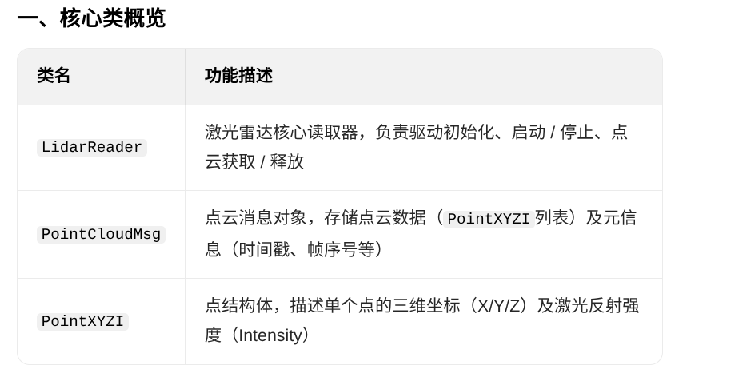
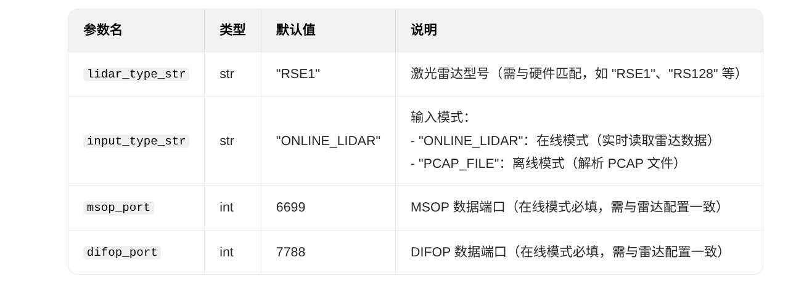
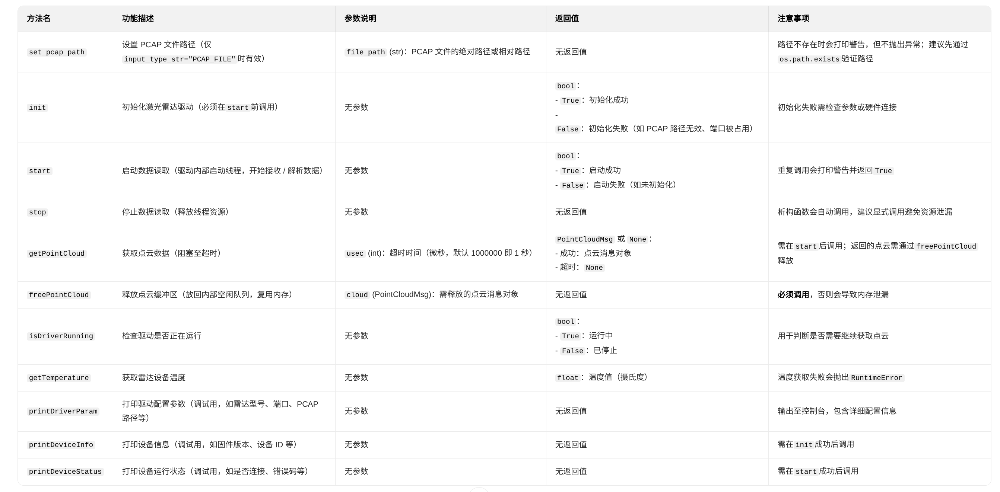
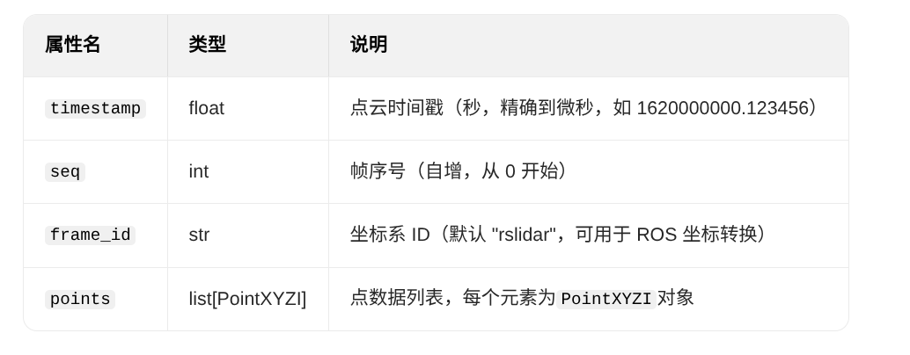
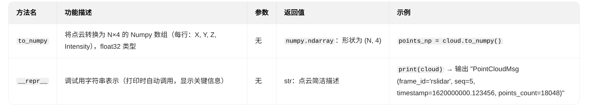
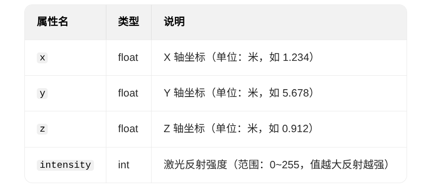
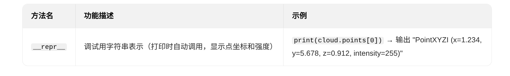
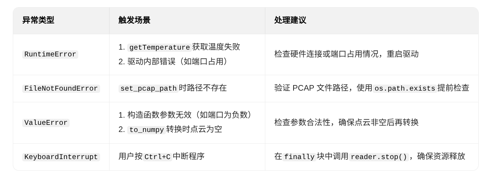

## 使用说明
### 1. 导入rs_lidar 库
```python
import rs_lidar
```
### 2. 创建Lidar对象
请选择好你的Lidar类型，以及工作模式，确认msop_port与difop_port端口，然后初始化并启动Lidar
#### ONLINE_LIDAR：在线雷达模式
```python
reader = rs_lidar.LidarReader("RSE1", "ONLINE_LIDAR", 6699, 7788)
reader.init()
reader.start()
```
#### PCAP_FILE：PCAP文件模式
```python
reader = rs_lidar.LidarReader("RSE1", "PCAP_FILE", 6699, 7788)
reader.set_pcap_path("your.pcap")
```

### 3.初始化并启动Lidar
```python
reader.init()
reader.start()
```

### 4. 获取点云数据并转换为Numpy数组
```python
cloud=reader.getPointCloud()
points_np = cloud.to_numpy()
```
### 5. 释放资源
```python
reader.freePointCloud(cloud)
```

### 6. 关闭Lidar
```python
reader.close()
```

## 详细API

### 核心类与结构概览


### 详细API说明
#### 核心类LidarReader

- **构造方法**
```Python
rs_lidar.LidarReader(lidar_type_str="RSE1", input_type_str="ONLINE_LIDAR", 
  msop_port=6699, difop_port=7788)
```
- **参数说明**


- **方法说明**


#### 点云消息类：PointCloudMsg

- **属性说明**


- **方法说明**


#### 点结构体类：PointXYZI

- **属性说明**


- **方法说明**



### 异常捕获


